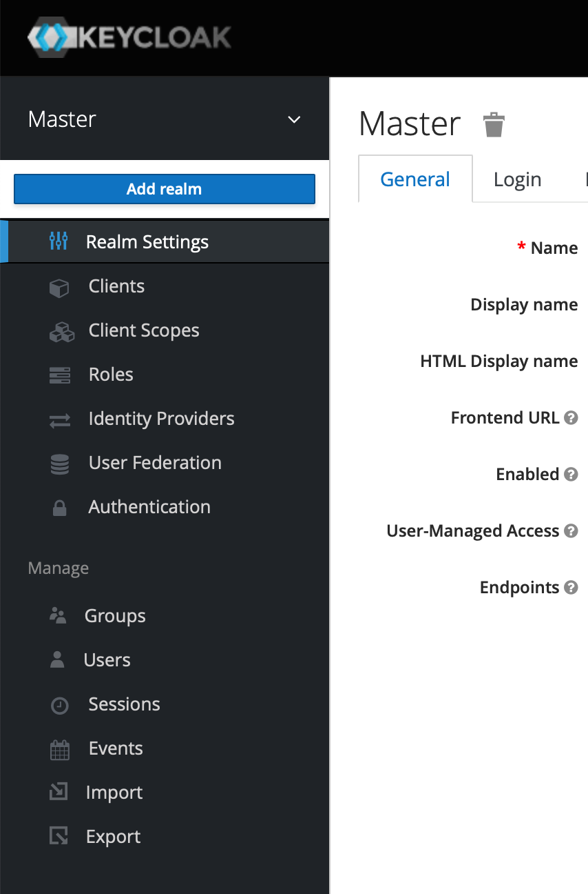
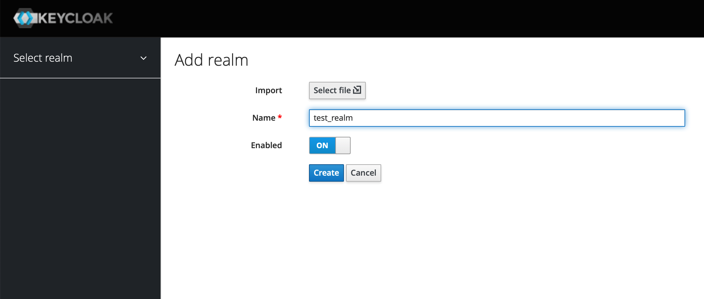
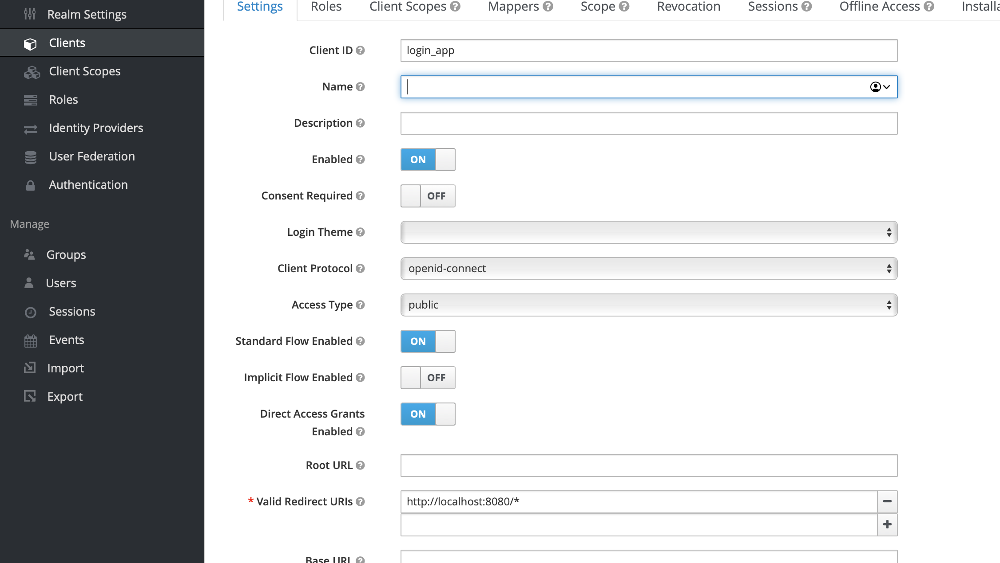
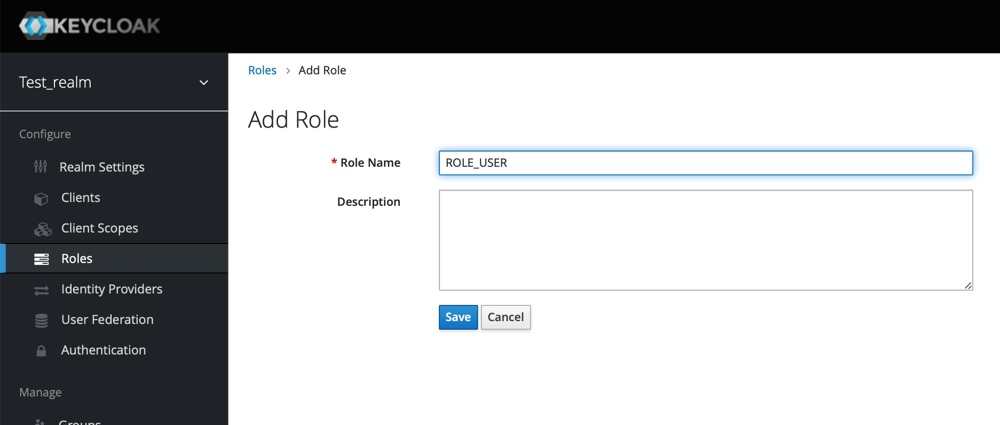
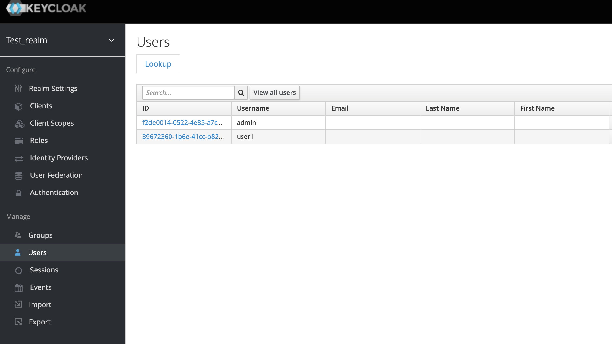
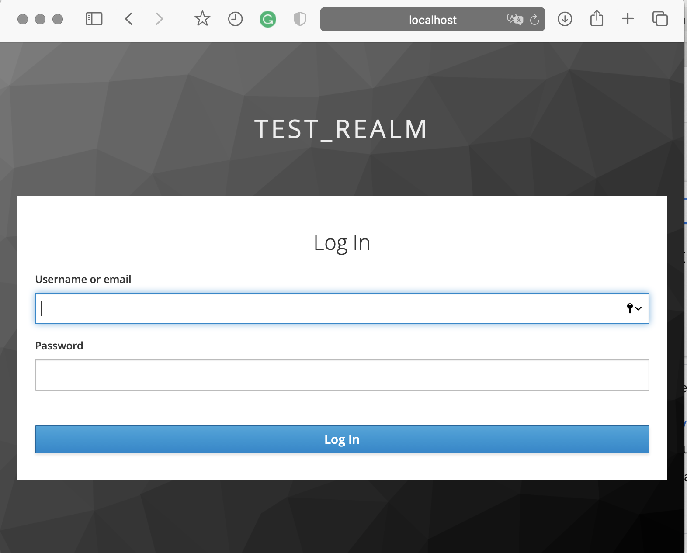
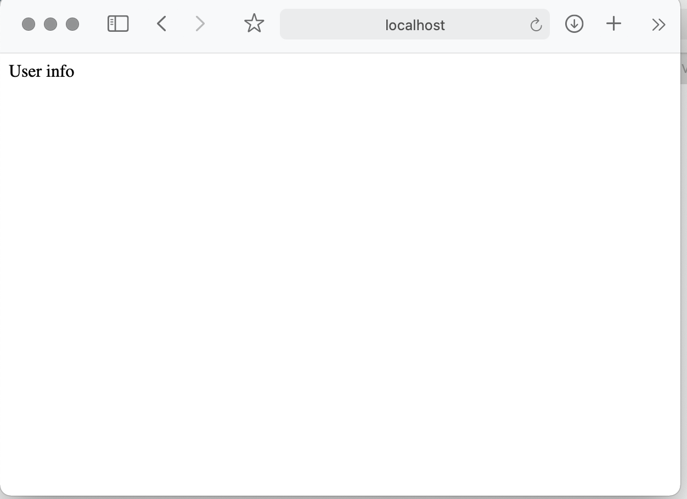

# Vanilla keycloak and spring boot

In previous posts, we connect keycloak with microservices using a clean spring security mechanism. Now we try to connect
to the keycloak authorization service using the keycloak adapter. The big advantage of this approach is less
configuration than clean spring security is used.

## Configure keycloak

You could run keycloak through docker-compose. In the root path open terminal and typing:

```bash
docker-compose up -d
```

Next, open the browser at address: `http://localhost:8484`, user admin/admin. Create realm:


Realm configuration:


Next, we need to create a client for the application. Create client "login-app":


Next, add users and roles.

Add user role:


Add admin role:


Last, add users and assign roles:


## Create application

Using http://start.spring.io/ create an application. Also, we need to add spring-security and keycloak dependencies:
`build.gradle.kts`:

```kotlin
dependencies {
    implementation("org.springframework.boot:spring-boot-starter-security")
    implementation("org.springframework.boot:spring-boot-starter-web")

    val keycloakVersion = "12.0.1"

    implementation("org.keycloak:keycloak-spring-boot-starter:$keycloakVersion")
}
```

To configure keycloak security, we need to extend `KeycloakWebSecurityConfigurerAdapter`:

```kotlin
@KeycloakConfiguration
@EnableGlobalMethodSecurity(prePostEnabled = true)
class WebSecurityConfig : KeycloakWebSecurityConfigurerAdapter() {
    @Bean
    override fun sessionAuthenticationStrategy(): SessionAuthenticationStrategy = NullAuthenticatedSessionStrategy()


    @Autowired
    fun configureGlobal(auth: AuthenticationManagerBuilder) {
        val keycloakAuthenticationProvider = keycloakAuthenticationProvider()
        keycloakAuthenticationProvider.setGrantedAuthoritiesMapper(SimpleAuthorityMapper())
        auth.authenticationProvider(keycloakAuthenticationProvider)
    }

    @Bean
    fun keycloakConfigResolver(): KeycloakConfigResolver {
        return KeycloakSpringBootConfigResolver()
    }

    override fun configure(http: HttpSecurity) {
        super.configure(http)
        http
            .authorizeRequests()
            .antMatchers("/api/public/**").permitAll()
            .anyRequest().fullyAuthenticated()
    }
}
```

We allow all request for `/api/public/**` prefix. Just for testing, let’s create a controller that will provide differently
URLs for different user roles:

```kotlin
@RestController
@RequestMapping("/api/test/")
class TestController {
    @GetMapping("user")
    @PreAuthorize("hasRole('USER')")
    fun getUserInfo(): ResponseEntity<String> = ResponseEntity.ok("User info")

    @GetMapping("admin")
    @PreAuthorize("hasRole('ADMIN')")
    fun getAdminInfo(): ResponseEntity<String> = ResponseEntity.ok("Admin info")
}
```

Finally, add keycloak configuration properties to `application.yml`:

```yaml
keycloak:
  auth-server-url: http://localhost:8484/auth
  realm: test_realm
  resource: login_app
  public-client: true
#  bearer-only: true
```

If we set the `bearer-only: true` property, then our application will not initialize login operation redirecting, just only
verify token.

## Run it

Let’s see some features of keycloak and spring security. Run application and type `http://localhost:8080/api/test/user`
in the browser window. You will see the keycloak user login page.


Enter login password for the user, you will be redirected to "user info page":


**Note:** If you set `bearer-only: true` then you will not be redirected to the login page. 

That's all. 
Thanks!
Happy coding.